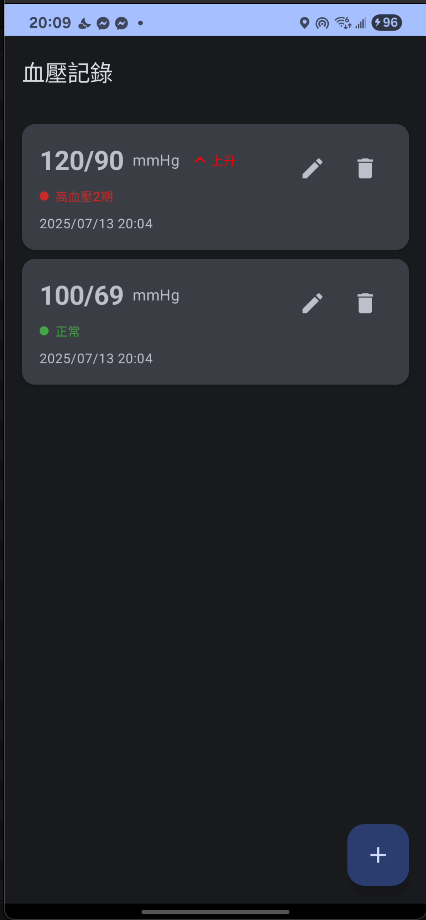

# 血壓記錄 APP

<div align="center">
  
</div>

這是一個使用 Android Jetpack Compose、Room Database 和 MVI 架構模式開發的血壓記錄應用程序。

## 主要功能

- 📊 記錄血壓值（收縮壓/舒張壓）
- ❤️ 記錄心率
- 📅 記錄日期和時間
- 📝 添加備註
- ✏️ 編輯已有記錄
- 🗑️ 刪除記錄
- 📱 現代化的 Material Design UI

## 應用界面預覽

<div align="center">
  
</div>

## 技術架構

### MVI 架構
- **Model**: 數據層（Entity, DAO, Repository）
- **View**: UI 層（Compose UI）
- **Intent**: 用戶意圖和狀態管理

### 主要技術棧
- **Kotlin**: 主要編程語言
- **Jetpack Compose**: 現代化的 UI 工具包
- **Room Database**: 本地數據庫
- **Coroutines**: 異步編程
- **StateFlow**: 狀態管理
- **Material Design 3**: UI 設計規範

## 項目結構

```
app/src/main/java/com/example/bptrack/
├── data/
│   ├── converter/          # 數據轉換器
│   ├── dao/               # 數據訪問對象
│   ├── database/          # 數據庫配置
│   ├── entity/            # 數據實體
│   └── repository/        # 數據倉庫
├── ui/
│   ├── component/         # UI 組件
│   ├── intent/           # MVI 意圖
│   ├── screen/           # 頁面
│   ├── state/            # 狀態定義
│   ├── theme/            # 主題配置
│   └── viewmodel/        # 視圖模型
└── MainActivity.kt       # 主活動
```

## 使用方法

1. 打開應用程序
2. 點擊右下角的 "+" 按鈕添加新記錄
3. 填寫血壓值、心率（可選）和備註
4. 點擊"儲存"保存記錄
5. 在主頁面查看所有記錄
6. 長按記錄可以編輯或刪除

## 開發環境要求

- Android Studio Arctic Fox 或更高版本
- Kotlin 1.8.0 或更高版本
- Android SDK 24 或更高版本
- Gradle 8.1.0 或更高版本

## 構建和運行

1. 克隆項目到本地
2. 在 Android Studio 中打開項目
3. 等待 Gradle 同步完成
4. 運行項目

## 功能特性

- ✅ 離線存儲（Room Database）
- ✅ 響應式 UI（Jetpack Compose）
- ✅ 狀態管理（MVI 架構）
- ✅ 數據驗證
- ✅ 用戶友好的界面
- ✅ 支持編輯和刪除
- ✅ 現代化設計

## 未來增強功能

- 📈 圖表和統計分析
- 🔄 數據備份和恢復
- 📊 健康趨勢分析
- 🏥 醫生報告生成
- 🔔 提醒功能
- 📱 Widget 支持

## 許可證

此項目僅供學習和個人使用。 