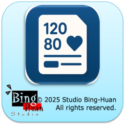
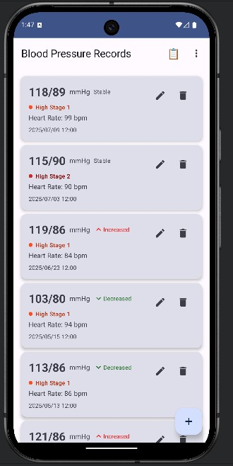
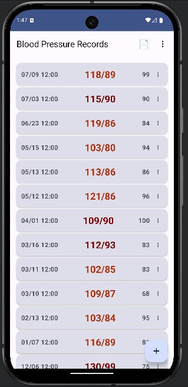

# 血壓記錄 APP

<div align="center">
  
</div>

這是一個使用 Android Jetpack Compose、Room Database 和 MVI 架構模式開發的血壓記錄應用程序。

## 主要功能

- 📊 記錄血壓值（收縮壓/舒張壓）
- ❤️ 記錄心率
- 📅 記錄日期和時間
- 📝 添加備註
- ✏️ 編輯已有記錄
- 🗑️ 刪除記錄
- 🩺 智能血壓分類（基於AHA標準）
- 📈 血壓趨勢分析
- 📋 雙檢視模式（詳細/簡潔）
- 📤 CSV匯出分享功能
- 📥 CSV匯入功能
- 🎨 主題適配（Dark/Light模式）
- 🌐 雙語支持（中文/英文）
- 📱 現代化的 Material Design UI

## 應用界面預覽

<div align="center">
  
  
</div>

*左圖：檢視模式切換按鈕，右圖：簡潔檢視模式 - 更多記錄，更少空間*

## 技術架構

### MVI 架構
- **Model**: 數據層（Entity, DAO, Repository）
- **View**: UI 層（Compose UI）
- **Intent**: 用戶意圖和狀態管理

### 主要技術棧
- **Kotlin**: 主要編程語言
- **Jetpack Compose**: 現代化的 UI 工具包
- **Room Database**: 本地數據庫
- **Coroutines**: 異步編程
- **StateFlow**: 狀態管理
- **Material Design 3**: UI 設計規範
- **Dark/Light Theme**: 主題適配支持
- **Internationalization**: 國際化支持

## 項目結構

```
app/src/main/java/com/bh/bptrack/
├── data/
│   ├── converter/          # 數據轉換器
│   ├── dao/               # 數據訪問對象
│   ├── database/          # 數據庫配置
│   ├── entity/            # 數據實體
│   └── repository/        # 數據倉庫
├── ui/
│   ├── component/         # UI 組件
│   ├── intent/           # MVI 意圖
│   ├── screen/           # 頁面
│   ├── state/            # 狀態定義
│   ├── theme/            # 主題配置
│   └── viewmodel/        # 視圖模型
└── MainActivity.kt       # 主活動
```

## 核心功能特色

### 🩺 智能血壓分類
- **AHA標準分類**: 基於美國心臟協會標準，自動分類血壓等級
- **實時反饋**: 輸入血壓值時即時顯示分類結果
- **顏色編碼**: 不同血壓等級配有相應的顏色標識
- **醫學指導**: 提供各分類的詳細醫學描述

### 📈 血壓趨勢分析
- **智能對比**: 自動比較與前次記錄的變化
- **趨勢指示**: 顯示血壓上升、下降或穩定狀態
- **視覺化提示**: 使用箭頭圖標直觀展示趨勢

### 📋 雙檢視模式
- **詳細檢視**: 完整顯示血壓分類、趨勢分析和所有記錄詳情
- **簡潔檢視**: 緊湊布局，最大化顯示記錄數量，適合快速瀏覽
- **一鍵切換**: 頂部工具欄快速切換檢視模式
- **智能布局**: 簡潔模式自動調整間距和字體大小

### 📤📥 CSV 數據管理
- **CSV匯出**: 將所有血壓記錄匯出為標準CSV格式
- **系統分享**: 透過系統分享功能發送CSV文件
- **CSV匯入**: 支援從外部CSV文件匯入血壓記錄
- **智能去重**: 匯入時自動處理相同日期的重複記錄
- **數據驗證**: 完整的數據格式驗證和錯誤處理

### 🎨 主題適配
- **Dark/Light模式**: 完整支持系統主題切換
- **動態顏色**: 文字顏色根據主題模式自動調整
- **視覺優化**: 確保在不同主題下都有良好的可讀性

## 使用方法

### 📊 基本操作
1. 打開應用程序
2. 點擊右下角的 "+" 按鈕添加新記錄
3. 填寫血壓值、心率（可選）和備註
4. 點擊"儲存"保存記錄
5. 在主頁面查看所有記錄
6. 點擊記錄的選單按鈕可以編輯或刪除

### 📋 檢視模式切換
1. 在主頁面頂部工具欄找到檢視模式按鈕（📄/📋）
2. 點擊按鈕在詳細檢視和簡潔檢視間切換
3. **詳細檢視**：顯示完整的血壓分析和趨勢
4. **簡潔檢視**：緊湊布局，一次顯示更多記錄

### 📤📥 CSV 數據管理
1. **匯出數據**：點擊右上角選單 → 選擇"📤 分享CSV"
2. **分享數據**：選擇要分享的應用（郵件、雲端等）
3. **匯入數據**：點擊右上角選單 → 選擇"📥 匯入CSV"
4. **選擇文件**：從文件管理器選擇CSV文件
5. **數據處理**：系統自動驗證並處理重複記錄

## 開發環境要求

- Android Studio Arctic Fox 或更高版本
- Kotlin 1.8.0 或更高版本
- Android SDK 24 或更高版本
- Gradle 8.1.0 或更高版本

## 構建和運行

1. 克隆項目到本地
2. 在 Android Studio 中打開項目
3. 等待 Gradle 同步完成
4. 運行項目

## 功能特性

- ✅ 離線存儲（Room Database）
- ✅ 響應式 UI（Jetpack Compose）
- ✅ 狀態管理（MVI 架構）
- ✅ 數據驗證
- ✅ 用戶友好的界面
- ✅ 支持編輯和刪除
- ✅ 現代化設計
- ✅ 雙檢視模式切換
- ✅ CSV 匯入匯出功能
- ✅ 智能數據去重處理

## 未來增強功能

- 📈 圖表和統計分析
- 📊 更詳細的健康趨勢分析
- 🏥 醫生報告生成
- 🔔 測量提醒功能
- 📱 Widget 支持
- 🏷️ 標籤和分類功能
- 📅 時間範圍篩選

## 許可證

此項目僅供學習和個人使用。 