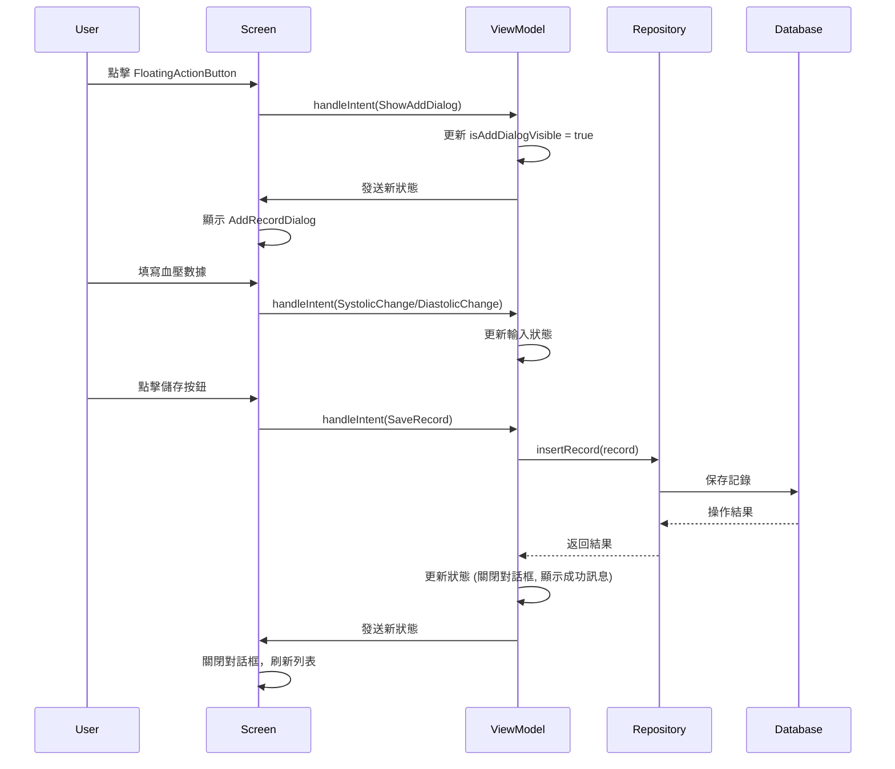
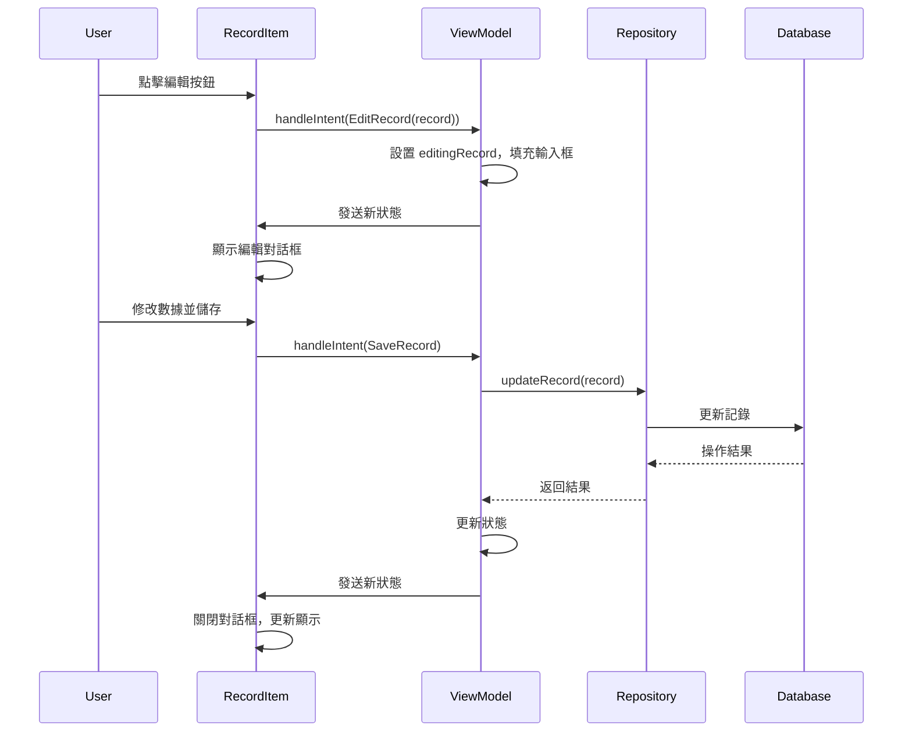
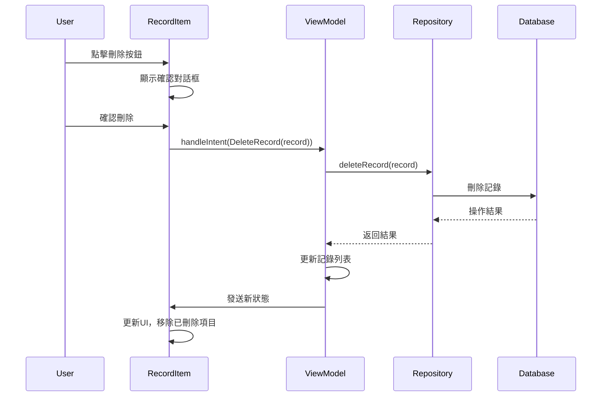

# 血壓記錄應用 - 架構教程

## 🏗️ 應用架構概述

本應用採用 **MVI (Model-View-Intent)** 架構模式，結合 **Clean Architecture** 原則，提供清晰的層次分離和單向數據流。

### 🎯 架構優勢
- **單向數據流**: 數據流向可預測，易於調試
- **狀態管理**: 集中式狀態管理，UI狀態一致性
- **可測試性**: 各層職責明確，便於單元測試
- **可維護性**: 代碼結構清晰，易於擴展和修改
- **主題適配**: 支持Dark/Light模式，動態顏色切換
- **國際化**: 完整的雙語支持，易於擴展其他語言

## 📁 項目結構

```
app/src/main/java/com/bh/bptrack/
├── MainActivity.kt                 # 應用入口點
├── data/                          # 數據層
│   ├── entity/                    # 數據實體
│   │   └── BloodPressureRecord.kt # 血壓記錄實體
│   ├── dao/                       # 數據訪問對象
│   │   └── BloodPressureDao.kt    # 血壓記錄DAO
│   ├── database/                  # 數據庫配置
│   │   └── BloodPressureDatabase.kt # Room數據庫
│   ├── converter/                 # 類型轉換器
│   │   └── DateTimeConverter.kt   # 日期時間轉換器
│   └── repository/                # 數據倉庫
│       └── BloodPressureRepository.kt # 血壓數據倉庫
└── ui/                           # UI層
    ├── intent/                   # 用戶意圖
    │   └── BloodPressureIntent.kt # 血壓相關意圖
    ├── state/                    # UI狀態
    │   └── BloodPressureState.kt  # 血壓UI狀態
    ├── viewmodel/                # 視圖模型
    │   ├── BloodPressureViewModel.kt        # 血壓ViewModel
    │   └── BloodPressureViewModelFactory.kt # ViewModel工廠
    ├── screen/                   # 畫面組件
    │   └── BloodPressureScreen.kt # 主畫面
    ├── component/                # UI組件
    │   ├── AddRecordDialog.kt     # 新增記錄對話框
    │   └── BloodPressureRecordItem.kt # 血壓記錄項目
    └── theme/                    # 主題配置
        ├── Color.kt              # 顏色定義
        ├── Theme.kt              # 主題配置
        └── Type.kt               # 字體配置
```

## 🔄 MVI 架構詳解

### 📊 MVI 組件說明

#### 1. **Model (數據模型)**
- **BloodPressureState**: 包含所有UI狀態
- **BloodPressureRecord**: 血壓記錄數據實體

#### 2. **View (視圖)**
- **BloodPressureScreen**: 主畫面組件
- **AddRecordDialog**: 新增記錄對話框
- **BloodPressureRecordItem**: 記錄項目組件

#### 3. **Intent (用戶意圖)**
- **BloodPressureIntent**: 封裝所有用戶操作意圖

### 🔄 數據流向

```
User Action → Intent → ViewModel → Repository → Database
     ↑                                              ↓
     ←─────── UI State ←─────── State ←─────── Data ←
```

## 🎯 核心組件詳解

### 1. BloodPressureIntent (用戶意圖)

```kotlin
sealed class BloodPressureIntent {
    // 基本操作
    object LoadRecords : BloodPressureIntent()
    object ShowAddDialog : BloodPressureIntent()
    object HideAddDialog : BloodPressureIntent()
    object SaveRecord : BloodPressureIntent()
    object ClearMessage : BloodPressureIntent()
    
    // 日期時間選擇
    object ShowDatePicker : BloodPressureIntent()
    object HideDatePicker : BloodPressureIntent()
    object ShowTimePicker : BloodPressureIntent()
    object HideTimePicker : BloodPressureIntent()
    
    // 記錄操作
    data class EditRecord(val record: BloodPressureRecord) : BloodPressureIntent()
    data class DeleteRecord(val record: BloodPressureRecord) : BloodPressureIntent()
    
    // 輸入更新
    data class UpdateSystolic(val value: String) : BloodPressureIntent()
    data class UpdateDiastolic(val value: String) : BloodPressureIntent()
    data class UpdateHeartRate(val value: String) : BloodPressureIntent()
    data class UpdateNotes(val value: String) : BloodPressureIntent()
    data class UpdateDateTime(val dateTime: LocalDateTime) : BloodPressureIntent()
}
```

**作用**: 封裝所有用戶可能的操作，提供類型安全的意圖系統。每個Intent代表一個明確的用戶操作或系統事件。

### 2. BloodPressureState (UI狀態)

```kotlin
data class BloodPressureState(
    val records: List<BloodPressureRecord> = emptyList(),
    val isLoading: Boolean = false,
    val error: String? = null,
    val isAddDialogVisible: Boolean = false,
    val editingRecord: BloodPressureRecord? = null,
    val systolicInput: String = "",
    val diastolicInput: String = "",
    // ... 其他狀態
)
```

**作用**: 統一管理所有UI狀態，確保狀態的一致性和可預測性。

### 3. BloodPressureViewModel (視圖模型)

```kotlin
class BloodPressureViewModel(
    private val repository: BloodPressureRepository
) : ViewModel() {
    
    private val _state = MutableStateFlow(BloodPressureState())
    val state: StateFlow<BloodPressureState> = _state.asStateFlow()
    
    fun handleIntent(intent: BloodPressureIntent) {
        // 處理各種用戶意圖
    }
}
```

**作用**: 處理業務邏輯，管理UI狀態，協調數據層操作。

```kotlin
// ViewModel中的handleIntent實現
fun handleIntent(intent: BloodPressureIntent) {
    when (intent) {
        is BloodPressureIntent.LoadRecords -> loadRecords()
        is BloodPressureIntent.ShowAddDialog -> showAddDialog()
        is BloodPressureIntent.SaveRecord -> saveRecord()
        is BloodPressureIntent.DeleteRecord -> deleteRecord(intent.record)
        is BloodPressureIntent.UpdateSystolic -> updateSystolic(intent.value)
        // ... 其他Intent處理
    }
}

private fun showAddDialog() {
    _state.value = _state.value.copy(
        isAddDialogVisible = true,
        editingRecord = null,
        systolicInput = "",
        diastolicInput = "",
        heartRateInput = "",
        notesInput = ""
    )
}
```

## 🔄 按鈕交互流程

### 💡 具體實現示例

#### UI組件中的按鈕觸發Intent
```kotlin
// BloodPressureScreen.kt 中的FloatingActionButton
FloatingActionButton(
    onClick = { 
        viewModel.handleIntent(BloodPressureIntent.ShowAddDialog)
    }
) {
    Icon(Icons.Default.Add, contentDescription = stringResource(R.string.add_record))
}

// AddRecordDialog.kt 中的儲存按鈕
Button(
    onClick = { 
        viewModel.handleIntent(BloodPressureIntent.SaveRecord)
    },
    enabled = isSystolicValid && isDiastolicValid
) {
    Text(stringResource(R.string.save))
}

// BloodPressureRecordItem.kt 中的編輯按鈕
IconButton(
    onClick = { 
        viewModel.handleIntent(BloodPressureIntent.EditRecord(record))
    }
) {
    Icon(Icons.Default.Edit, contentDescription = stringResource(R.string.edit))
}
```

#### 狀態監聽和UI更新
```kotlin
// 在Composable中監聽狀態變化
val state by viewModel.state.collectAsState()

// 根據狀態顯示對話框
if (state.isAddDialogVisible) {
    AddRecordDialog(
        state = state,
        onSave = { viewModel.handleIntent(BloodPressureIntent.SaveRecord) },
        onCancel = { viewModel.handleIntent(BloodPressureIntent.HideAddDialog) },
        onSystolicChange = { viewModel.handleIntent(BloodPressureIntent.UpdateSystolic(it)) }
    )
}
```

### 1. 新增記錄流程



### 2. 編輯記錄流程



### 3. 刪除記錄流程



## 🔧 技術棧

### **UI層**
- **Jetpack Compose**: 現代化UI框架
- **Material Design 3**: Google設計語言
- **Navigation Compose**: 導航管理

### **架構層**
- **MVI Pattern**: 架構模式
- **ViewModel**: 狀態管理
- **StateFlow**: 反應式狀態流
- **Coroutines**: 異步處理

### **數據層**
- **Room Database**: 本地數據庫
- **Repository Pattern**: 數據訪問抽象
- **Entity**: 數據模型

### **UI與主題**
- **Material Design 3**: 現代化UI設計語言
- **Dark/Light Theme**: 主題適配系統
- **Dynamic Colors**: 動態顏色管理
- **Internationalization**: 國際化支持

### **依賴注入**
- **手動DI**: ViewModelFactory模式

## 🚀 功能特色

### 1. **血壓分類系統**
- 自動分析血壓等級（正常、升高、高血壓1期等）
- 實時顏色反饋提示
- 符合醫學標準的分類
- 主題適配顏色顯示

### 2. **趨勢分析**
- 自動比較與上次測量的變化
- 視覺化趨勢指示（上升、下降、穩定）
- 幫助用戶了解血壓變化

### 3. **國際化支持**
- 中文（繁體）和英文雙語
- 自動根據系統語言切換
- 完整的本地化資源

### 4. **現代化UI**
- Material Design 3設計語言
- 響應式布局設計
- 平滑的動畫效果
- Dark/Light主題支持
- 動態顏色適配

## ⚡ 關鍵特性深入解析

### 1. **血壓分類系統**

血壓分類基於美國心臟協會(AHA)標準：

```kotlin
// BPCategory枚舉
enum class BPCategory(
    val nameRes: Int,
    val color: Color,
    val descriptionRes: Int
) {
    NORMAL(R.string.bp_category_normal, Color(0xFF2E7D32), R.string.bp_category_normal_desc),
    ELEVATED(R.string.bp_category_elevated, Color(0xFFFF9800), R.string.bp_category_elevated_desc),
    HIGH_STAGE_1(R.string.bp_category_high_stage_1, Color(0xFFFF5722), R.string.bp_category_high_stage_1_desc),
    HIGH_STAGE_2(R.string.bp_category_high_stage_2, Color(0xFFD32F2F), R.string.bp_category_high_stage_2_desc),
    HYPERTENSIVE_CRISIS(R.string.bp_category_hypertensive_crisis, Color(0xFF880E4F), R.string.bp_category_hypertensive_crisis_desc)
}

// 分類計算邏輯
fun calculateBPCategory(systolic: Int, diastolic: Int): BPCategory {
    return when {
        systolic >= 180 || diastolic >= 120 -> BPCategory.HYPERTENSIVE_CRISIS
        systolic >= 140 || diastolic >= 90 -> BPCategory.HIGH_STAGE_2
        systolic >= 130 || diastolic >= 80 -> BPCategory.HIGH_STAGE_1
        systolic >= 120 && diastolic < 80 -> BPCategory.ELEVATED
        systolic < 120 && diastolic < 80 -> BPCategory.NORMAL
        else -> BPCategory.HIGH_STAGE_1
    }
}
```

### 2. **趨勢分析算法**

```kotlin
fun calculateBloodPressureTrend(
    current: BloodPressureRecord,
    previous: BloodPressureRecord?
): BloodPressureTrend {
    if (previous == null) return BloodPressureTrend.FIRST_RECORD
    
    val currentAvg = (current.systolic + current.diastolic) / 2.0
    val previousAvg = (previous.systolic + previous.diastolic) / 2.0
    
    return when {
        currentAvg > previousAvg + 2 -> BloodPressureTrend.INCREASED
        currentAvg < previousAvg - 2 -> BloodPressureTrend.DECREASED
        else -> BloodPressureTrend.STABLE
    }
}
```

### 3. **主題適配系統**

應用支持Dark/Light模式，確保在不同主題下都有良好的視覺體驗：

```kotlin
// 主題檢測和顏色適配
@Composable
fun getBPCategoryTextColor(
    category: BPCategory,
    isDarkTheme: Boolean = isSystemInDarkTheme()
): Color {
    return when (category) {
        BPCategory.NORMAL -> if (isDarkTheme) Color(0xFF66BB6A) else Color(0xFF1B5E20)
        BPCategory.ELEVATED -> if (isDarkTheme) Color(0xFFFFB74D) else Color(0xFFE65100)
        BPCategory.HIGH_STAGE_1 -> if (isDarkTheme) Color(0xFFFF8A65) else Color(0xFFBF360C)
        BPCategory.HIGH_STAGE_2 -> if (isDarkTheme) Color(0xFFEF5350) else Color(0xFF8B0000)
        BPCategory.HYPERTENSIVE_CRISIS -> if (isDarkTheme) Color(0xFFAD1457) else Color(0xFF4A0E4E)
    }
}

// 在UI組件中使用
Text(
    text = stringResource(bpCategory.nameRes),
    color = getBPCategoryTextColor(bpCategory),
    style = MaterialTheme.typography.bodySmall
)
```

**主題適配原則：**
- **Dark模式**: 使用亮色系文字，確保在深色背景下清晰可見
- **Light模式**: 使用暗色系文字，提供良好的對比度
- **動態切換**: 根據系統主題自動調整，無需手動切換

### 4. **國際化支持**

應用支持Traditional Chinese和English雙語：

```kotlin
// 字符串資源組織
res/values/strings.xml        # 中文（默認）
res/values-en/strings.xml     # 英文

// 使用方式
stringResource(R.string.bp_category_normal)
```

### 5. **錯誤處理機制**

```kotlin
// ViewModel中的統一錯誤處理
private fun handleOperation(operation: suspend () -> Unit) {
    viewModelScope.launch {
        try {
            _state.value = _state.value.copy(isLoading = true, error = null)
            operation()
        } catch (e: Exception) {
            _state.value = _state.value.copy(
                isLoading = false,
                error = e.message ?: "Unknown error occurred"
            )
        }
    }
}
```

## 📝 開發最佳實踐

### 1. **狀態管理**
```kotlin
// ✅ 好的做法：使用不可變狀態
_state.value = _state.value.copy(
    isLoading = false,
    records = newRecords
)

// ❌ 避免：直接修改狀態
_state.value.records.clear()
```

### 2. **錯誤處理**
```kotlin
// ✅ 好的做法：統一錯誤處理
try {
    repository.insertRecord(record)
    _state.value = _state.value.copy(message = "Record saved")
} catch (e: Exception) {
    _state.value = _state.value.copy(error = e.message)
}
```

### 3. **資源管理**
```kotlin
// ✅ 好的做法：使用字符串資源
Text(stringResource(R.string.blood_pressure_records))

// ❌ 避免：硬編碼文字
Text("血壓記錄")
```

### 4. **主題適配**
```kotlin
// ✅ 好的做法：使用主題適配函數
Text(
    text = stringResource(bpCategory.nameRes),
    color = getBPCategoryTextColor(bpCategory)
)

// ❌ 避免：硬編碼顏色
Text(
    text = stringResource(bpCategory.nameRes),
    color = Color.Red
)
```

### 5. **國際化支持**
```kotlin
// ✅ 好的做法：所有文字都使用字符串資源
enum class BPCategory(
    val nameRes: Int,
    val descriptionRes: Int
) {
    NORMAL(R.string.bp_category_normal, R.string.bp_category_normal_desc)
}

// ❌ 避免：混合使用硬編碼和資源
enum class BPCategory(
    val name: String,
    val nameRes: Int
) {
    NORMAL("Normal", R.string.bp_category_normal)
}
```

## 🔄 擴展指南

### 添加新功能
1. **定義新的Intent**: 在 `BloodPressureIntent` 中添加新操作
2. **更新State**: 在 `BloodPressureState` 中添加必要狀態

### 擴展主題適配
要為新的UI組件添加主題適配支持：

```kotlin
// 1. 創建主題適配函數
@Composable
fun getCustomTextColor(
    type: CustomType,
    isDarkTheme: Boolean = isSystemInDarkTheme()
): Color {
    return when (type) {
        CustomType.PRIMARY -> if (isDarkTheme) Color.White else Color.Black
        CustomType.SECONDARY -> if (isDarkTheme) Color.Gray else Color.DarkGray
    }
}

// 2. 在UI組件中使用
Text(
    text = "Custom Text",
    color = getCustomTextColor(CustomType.PRIMARY)
)
```

### 添加新語言支持
1. **創建新的字符串資源文件**: `res/values-zh/strings.xml`
2. **翻譯所有字符串**: 確保所有字符串都有對應翻譯
3. **測試語言切換**: 在不同語言環境下測試應用
3. **實現邏輯**: 在 `ViewModel` 中處理新Intent
4. **更新UI**: 在相應組件中響應狀態變化

### 添加新頁面
1. **創建Screen組件**: 新的Composable函數
2. **定義導航**: 配置Navigation路由
3. **狀態管理**: 考慮是否需要新的ViewModel

## 🧪 測試策略

### 單元測試
- **ViewModel測試**: 測試業務邏輯和狀態管理
- **Repository測試**: 測試數據操作
- **Utility測試**: 測試工具函數

### UI測試
- **Compose測試**: 測試UI組件行為
- **Navigation測試**: 測試頁面導航
- **Integration測試**: 測試完整用戶流程

## 📚 學習資源

- [Jetpack Compose 官方文檔](https://developer.android.com/jetpack/compose)
- [MVI 架構指南](https://hannesdorfmann.com/android/model-view-intent/)
- [Room 數據庫文檔](https://developer.android.com/training/data-storage/room)
- [Material Design 3](https://m3.material.io/)

## 🎓 總結

### 🏆 應用亮點

1. **現代化架構**: 採用MVI架構模式，確保代碼的可維護性和可測試性
2. **醫學標準**: 基於AHA標準的血壓分類系統，提供專業的健康指導
3. **智能分析**: 自動趨勢分析，幫助用戶了解血壓變化模式
4. **國際化**: 完整的多語言支持，適應不同地區用戶需求
5. **用戶體驗**: Material Design 3設計，提供直觀易用的界面

### 📈 未來擴展方向

- **數據導出**: 支持CSV、PDF格式導出
- **圖表分析**: 添加血壓趨勢圖表
- **提醒系統**: 定時測量提醒功能
- **雲端同步**: 數據備份和同步功能
- **健康建議**: 基於AI的個性化健康建議

### 🔗 相關技術文檔

- **Android Architecture Components**: [官方指南](https://developer.android.com/topic/architecture)
- **Jetpack Compose**: [開發者文檔](https://developer.android.com/jetpack/compose)
- **Room Database**: [持久化數據](https://developer.android.com/training/data-storage/room)
- **Kotlin Coroutines**: [異步編程](https://kotlinlang.org/docs/coroutines-overview.html)

---

📝 **這個教程涵蓋了血壓記錄應用的完整架構和交互流程。通過理解這些概念，您可以更好地維護和擴展應用功能。**

🎯 **如果您在開發過程中有任何問題，建議參考各個組件的實際代碼實現，並結合本教程的架構說明進行理解。** 