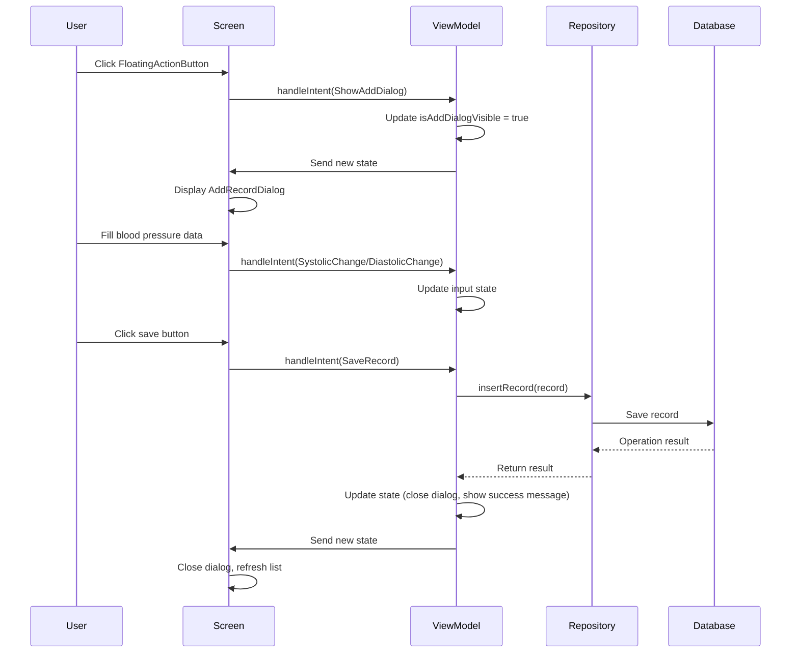
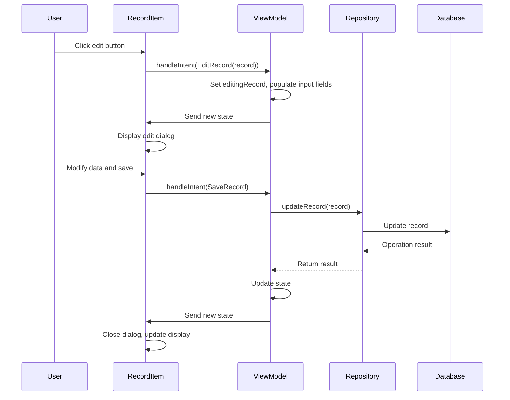
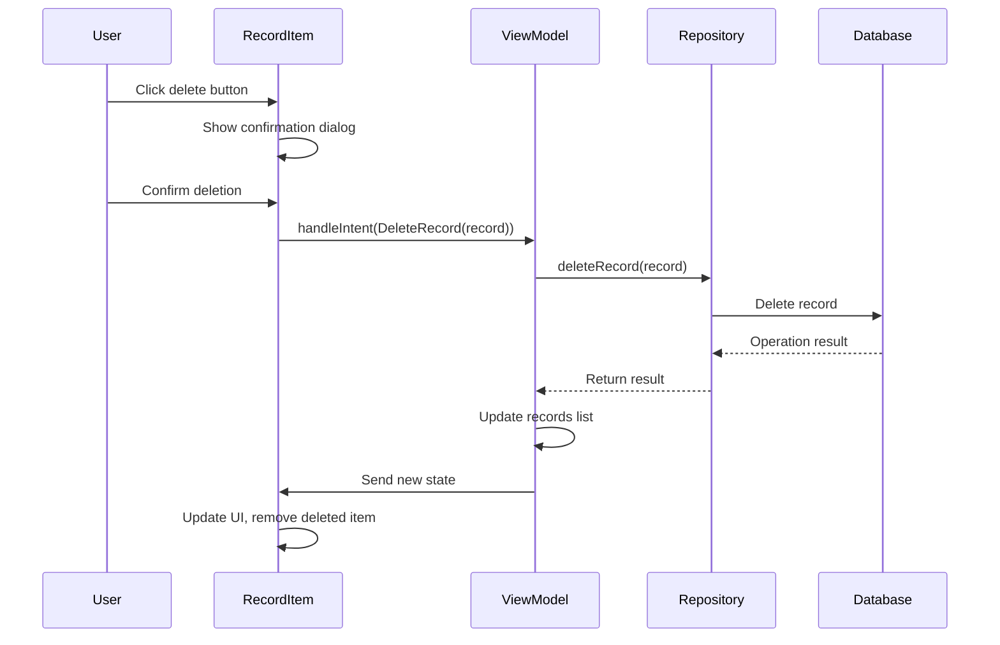

# Blood Pressure Tracker - Architecture Tutorial

## 🏗️ Application Architecture Overview

This application adopts the **MVI (Model-View-Intent)** architecture pattern, combined with **Clean Architecture** principles, providing clear layer separation and unidirectional data flow.

### 🎯 Architecture Advantages
- **Unidirectional Data Flow**: Predictable data flow, easy to debug
- **State Management**: Centralized state management, UI state consistency
- **Testability**: Clear responsibilities for each layer, easy to unit test
- **Maintainability**: Clear code structure, easy to extend and modify
- **Theme Adaptation**: Supports Dark/Light mode with dynamic color switching
- **Internationalization**: Complete bilingual support, easy to extend to other languages

## 📁 Project Structure

```
app/src/main/java/com/bh/bptrack/
├── MainActivity.kt                 # Application entry point
├── data/                          # Data layer
│   ├── entity/                    # Data entities
│   │   └── BloodPressureRecord.kt # Blood pressure record entity
│   ├── dao/                       # Data access objects
│   │   └── BloodPressureDao.kt    # Blood pressure record DAO
│   ├── database/                  # Database configuration
│   │   └── BloodPressureDatabase.kt # Room database
│   ├── converter/                 # Type converters
│   │   └── DateTimeConverter.kt   # Date time converter
│   └── repository/                # Data repositories
│       └── BloodPressureRepository.kt # Blood pressure data repository
└── ui/                           # UI layer
    ├── intent/                   # User intents
    │   └── BloodPressureIntent.kt # Blood pressure related intents
    ├── state/                    # UI states
    │   └── BloodPressureState.kt  # Blood pressure UI state
    ├── viewmodel/                # View models
    │   ├── BloodPressureViewModel.kt        # Blood pressure ViewModel
    │   └── BloodPressureViewModelFactory.kt # ViewModel factory
    ├── screen/                   # Screen components
    │   └── BloodPressureScreen.kt # Main screen
    ├── component/                # UI components
    │   ├── AddRecordDialog.kt     # Add record dialog
    │   └── BloodPressureRecordItem.kt # Blood pressure record item
    └── theme/                    # Theme configuration
        ├── Color.kt              # Color definitions
        ├── Theme.kt              # Theme configuration
        └── Type.kt               # Typography configuration
```

## 🔄 MVI Architecture Details

### 📊 MVI Components Explanation

#### 1. **Model (Data Model)**
- **BloodPressureState**: Contains all UI states
- **BloodPressureRecord**: Blood pressure record data entity

#### 2. **View (User Interface)**
- **BloodPressureScreen**: Main screen component
- **AddRecordDialog**: Add record dialog
- **BloodPressureRecordItem**: Record item component

#### 3. **Intent (User Intentions)**
- **BloodPressureIntent**: Encapsulates all user operation intents

### 🔄 Data Flow

```
User Action → Intent → ViewModel → Repository → Database
     ↑                                              ↓
     ←─────── UI State ←─────── State ←─────── Data ←
```

## 🎯 Core Components Details

### 1. BloodPressureIntent (User Intents)

```kotlin
sealed class BloodPressureIntent {
    // Basic operations
    object LoadRecords : BloodPressureIntent()
    object ShowAddDialog : BloodPressureIntent()
    object HideAddDialog : BloodPressureIntent()
    object SaveRecord : BloodPressureIntent()
    object ClearMessage : BloodPressureIntent()
    
    // Date time selection
    object ShowDatePicker : BloodPressureIntent()
    object HideDatePicker : BloodPressureIntent()
    object ShowTimePicker : BloodPressureIntent()
    object HideTimePicker : BloodPressureIntent()
    
    // Record operations
    data class EditRecord(val record: BloodPressureRecord) : BloodPressureIntent()
    data class DeleteRecord(val record: BloodPressureRecord) : BloodPressureIntent()
    
    // Input updates
    data class UpdateSystolic(val value: String) : BloodPressureIntent()
    data class UpdateDiastolic(val value: String) : BloodPressureIntent()
    data class UpdateHeartRate(val value: String) : BloodPressureIntent()
    data class UpdateNotes(val value: String) : BloodPressureIntent()
    data class UpdateDateTime(val dateTime: LocalDateTime) : BloodPressureIntent()
}
```

**Purpose**: Encapsulates all possible user operations, providing a type-safe intent system. Each Intent represents a clear user action or system event.

### 2. BloodPressureState (UI State)

```kotlin
data class BloodPressureState(
    val records: List<BloodPressureRecord> = emptyList(),
    val isLoading: Boolean = false,
    val error: String? = null,
    val isAddDialogVisible: Boolean = false,
    val editingRecord: BloodPressureRecord? = null,
    val systolicInput: String = "",
    val diastolicInput: String = "",
    // ... other states
)
```

**Purpose**: Unified management of all UI states, ensuring state consistency and predictability.

### 3. BloodPressureViewModel (View Model)

```kotlin
class BloodPressureViewModel(
    private val repository: BloodPressureRepository
) : ViewModel() {
    
    private val _state = MutableStateFlow(BloodPressureState())
    val state: StateFlow<BloodPressureState> = _state.asStateFlow()
    
    fun handleIntent(intent: BloodPressureIntent) {
        // Handle various user intents
    }
}
```

**Purpose**: Handles business logic, manages UI state, coordinates data layer operations.

```kotlin
// handleIntent implementation in ViewModel
fun handleIntent(intent: BloodPressureIntent) {
    when (intent) {
        is BloodPressureIntent.LoadRecords -> loadRecords()
        is BloodPressureIntent.ShowAddDialog -> showAddDialog()
        is BloodPressureIntent.SaveRecord -> saveRecord()
        is BloodPressureIntent.DeleteRecord -> deleteRecord(intent.record)
        is BloodPressureIntent.UpdateSystolic -> updateSystolic(intent.value)
        // ... other intent handling
    }
}

private fun showAddDialog() {
    _state.value = _state.value.copy(
        isAddDialogVisible = true,
        editingRecord = null,
        systolicInput = "",
        diastolicInput = "",
        heartRateInput = "",
        notesInput = ""
    )
}
```

## 🔄 Button Interaction Flows

### 💡 Implementation Examples

#### Button Triggers Intent in UI Components
```kotlin
// FloatingActionButton in BloodPressureScreen.kt
FloatingActionButton(
    onClick = { 
        viewModel.handleIntent(BloodPressureIntent.ShowAddDialog)
    }
) {
    Icon(Icons.Default.Add, contentDescription = stringResource(R.string.add_record))
}

// Save button in AddRecordDialog.kt
Button(
    onClick = { 
        viewModel.handleIntent(BloodPressureIntent.SaveRecord)
    },
    enabled = isSystolicValid && isDiastolicValid
) {
    Text(stringResource(R.string.save))
}

// Edit button in BloodPressureRecordItem.kt
IconButton(
    onClick = { 
        viewModel.handleIntent(BloodPressureIntent.EditRecord(record))
    }
) {
    Icon(Icons.Default.Edit, contentDescription = stringResource(R.string.edit))
}
```

#### State Listening and UI Updates
```kotlin
// Listen to state changes in Composable
val state by viewModel.state.collectAsState()

// Show dialog based on state
if (state.isAddDialogVisible) {
    AddRecordDialog(
        state = state,
        onSave = { viewModel.handleIntent(BloodPressureIntent.SaveRecord) },
        onCancel = { viewModel.handleIntent(BloodPressureIntent.HideAddDialog) },
        onSystolicChange = { viewModel.handleIntent(BloodPressureIntent.UpdateSystolic(it)) }
    )
}
```

### 1. Add Record Flow



### 2. Edit Record Flow



### 3. Delete Record Flow



## 🔧 Technology Stack

### **UI Layer**
- **Jetpack Compose**: Modern UI framework
- **Material Design 3**: Google design language
- **Navigation Compose**: Navigation management

### **Architecture Layer**
- **MVI Pattern**: Architectural pattern
- **ViewModel**: State management
- **StateFlow**: Reactive state flow
- **Coroutines**: Asynchronous processing

### **Data Layer**
- **Room Database**: Local database
- **Repository Pattern**: Data access abstraction
- **Entity**: Data models

### **UI & Theme**
- **Material Design 3**: Modern UI design language
- **Dark/Light Theme**: Theme adaptation system
- **Dynamic Colors**: Dynamic color management
- **Internationalization**: Internationalization support

### **Dependency Injection**
- **Manual DI**: ViewModelFactory pattern

## 🚀 Key Features

### 1. **Blood Pressure Classification System**
- Automatic analysis of blood pressure levels (normal, elevated, high stage 1, etc.)
- Real-time color feedback prompts
- Medical standard-compliant classification
- Theme-adaptive color display

### 2. **Trend Analysis**
- Automatic comparison with previous measurements
- Visual trend indicators (increased, decreased, stable)
- Helps users understand blood pressure changes

### 3. **Internationalization Support**
- Traditional Chinese and English bilingual support
- Automatic switching based on system language
- Complete localization resources

### 4. **Modern UI**
- Material Design 3 design language
- Responsive layout design
- Smooth animation effects
- Dark/Light theme support
- Dynamic color adaptation

## ⚡ Key Features Deep Dive

### 1. **Blood Pressure Classification System**

Blood pressure classification based on American Heart Association (AHA) standards:

```kotlin
// BPCategory enum
enum class BPCategory(
    val nameRes: Int,
    val color: Color,
    val descriptionRes: Int
) {
    NORMAL(R.string.bp_category_normal, Color(0xFF2E7D32), R.string.bp_category_normal_desc),
    ELEVATED(R.string.bp_category_elevated, Color(0xFFFF9800), R.string.bp_category_elevated_desc),
    HIGH_STAGE_1(R.string.bp_category_high_stage_1, Color(0xFFFF5722), R.string.bp_category_high_stage_1_desc),
    HIGH_STAGE_2(R.string.bp_category_high_stage_2, Color(0xFFD32F2F), R.string.bp_category_high_stage_2_desc),
    HYPERTENSIVE_CRISIS(R.string.bp_category_hypertensive_crisis, Color(0xFF880E4F), R.string.bp_category_hypertensive_crisis_desc)
}

// Classification calculation logic
fun calculateBPCategory(systolic: Int, diastolic: Int): BPCategory {
    return when {
        systolic >= 180 || diastolic >= 120 -> BPCategory.HYPERTENSIVE_CRISIS
        systolic >= 140 || diastolic >= 90 -> BPCategory.HIGH_STAGE_2
        systolic >= 130 || diastolic >= 80 -> BPCategory.HIGH_STAGE_1
        systolic >= 120 && diastolic < 80 -> BPCategory.ELEVATED
        systolic < 120 && diastolic < 80 -> BPCategory.NORMAL
        else -> BPCategory.HIGH_STAGE_1
    }
}
```

### 2. **Trend Analysis Algorithm**

```kotlin
fun calculateBloodPressureTrend(
    current: BloodPressureRecord,
    previous: BloodPressureRecord?
): BloodPressureTrend {
    if (previous == null) return BloodPressureTrend.FIRST_RECORD
    
    val currentAvg = (current.systolic + current.diastolic) / 2.0
    val previousAvg = (previous.systolic + previous.diastolic) / 2.0
    
    return when {
        currentAvg > previousAvg + 2 -> BloodPressureTrend.INCREASED
        currentAvg < previousAvg - 2 -> BloodPressureTrend.DECREASED
        else -> BloodPressureTrend.STABLE
    }
}
```

### 3. **Theme Adaptation System**

The application supports Dark/Light mode, ensuring good visual experience under different themes:

```kotlin
// Theme detection and color adaptation
@Composable
fun getBPCategoryTextColor(
    category: BPCategory,
    isDarkTheme: Boolean = isSystemInDarkTheme()
): Color {
    return when (category) {
        BPCategory.NORMAL -> if (isDarkTheme) Color(0xFF66BB6A) else Color(0xFF1B5E20)
        BPCategory.ELEVATED -> if (isDarkTheme) Color(0xFFFFB74D) else Color(0xFFE65100)
        BPCategory.HIGH_STAGE_1 -> if (isDarkTheme) Color(0xFFFF8A65) else Color(0xFFBF360C)
        BPCategory.HIGH_STAGE_2 -> if (isDarkTheme) Color(0xFFEF5350) else Color(0xFF8B0000)
        BPCategory.HYPERTENSIVE_CRISIS -> if (isDarkTheme) Color(0xFFAD1457) else Color(0xFF4A0E4E)
    }
}

// Usage in UI components
Text(
    text = stringResource(bpCategory.nameRes),
    color = getBPCategoryTextColor(bpCategory),
    style = MaterialTheme.typography.bodySmall
)
```

**Theme Adaptation Principles:**
- **Dark mode**: Use light colors for text to ensure clarity on dark backgrounds
- **Light mode**: Use dark colors for text to provide good contrast
- **Dynamic switching**: Automatically adjusts based on system theme, no manual switching required

### 4. **Internationalization Support**

The application supports Traditional Chinese and English bilingual:

```kotlin
// String resource organization
res/values/strings.xml        # Chinese (default)
res/values-en/strings.xml     # English

// Usage
stringResource(R.string.bp_category_normal)
```

### 5. **Error Handling Mechanism**

```kotlin
// Unified error handling in ViewModel
private fun handleOperation(operation: suspend () -> Unit) {
    viewModelScope.launch {
        try {
            _state.value = _state.value.copy(isLoading = true, error = null)
            operation()
        } catch (e: Exception) {
            _state.value = _state.value.copy(
                isLoading = false,
                error = e.message ?: "Unknown error occurred"
            )
        }
    }
}
```

## 📝 Development Best Practices

### 1. **State Management**
```kotlin
// ✅ Good practice: Use immutable state
_state.value = _state.value.copy(
    isLoading = false,
    records = newRecords
)

// ❌ Avoid: Direct state modification
_state.value.records.clear()
```

### 2. **Error Handling**
```kotlin
// ✅ Good practice: Unified error handling
try {
    repository.insertRecord(record)
    _state.value = _state.value.copy(message = "Record saved")
} catch (e: Exception) {
    _state.value = _state.value.copy(error = e.message)
}
```

### 3. **Resource Management**
```kotlin
// ✅ Good practice: Use string resources
Text(stringResource(R.string.blood_pressure_records))

// ❌ Avoid: Hard-coded text
Text("Blood Pressure Records")
```

### 4. **Theme Adaptation**
```kotlin
// ✅ Good practice: Use theme adaptation functions
Text(
    text = stringResource(bpCategory.nameRes),
    color = getBPCategoryTextColor(bpCategory)
)

// ❌ Avoid: Hard-coded colors
Text(
    text = stringResource(bpCategory.nameRes),
    color = Color.Red
)
```

### 5. **Internationalization Support**
```kotlin
// ✅ Good practice: Use string resources for all text
enum class BPCategory(
    val nameRes: Int,
    val descriptionRes: Int
) {
    NORMAL(R.string.bp_category_normal, R.string.bp_category_normal_desc)
}

// ❌ Avoid: Mixed use of hard-coded and resource strings
enum class BPCategory(
    val name: String,
    val nameRes: Int
) {
    NORMAL("Normal", R.string.bp_category_normal)
}
```

## 🔄 Extension Guide

### Adding New Features
1. **Define new Intent**: Add new operation in `BloodPressureIntent`
2. **Update State**: Add necessary state in `BloodPressureState`
3. **Implement Logic**: Handle new Intent in `ViewModel`
4. **Update UI**: Respond to state changes in corresponding components

### Extending Theme Adaptation
To add theme adaptation support for new UI components:

```kotlin
// 1. Create theme adaptation function
@Composable
fun getCustomTextColor(
    type: CustomType,
    isDarkTheme: Boolean = isSystemInDarkTheme()
): Color {
    return when (type) {
        CustomType.PRIMARY -> if (isDarkTheme) Color.White else Color.Black
        CustomType.SECONDARY -> if (isDarkTheme) Color.Gray else Color.DarkGray
    }
}

// 2. Use in UI components
Text(
    text = "Custom Text",
    color = getCustomTextColor(CustomType.PRIMARY)
)
```

### Adding New Language Support
1. **Create new string resource file**: `res/values-zh/strings.xml`
2. **Translate all strings**: Ensure all strings have corresponding translations
3. **Test language switching**: Test the application under different language environments

### Adding New Pages
1. **Create Screen Component**: New Composable function
2. **Define Navigation**: Configure Navigation routes
3. **State Management**: Consider if new ViewModel is needed

## 🧪 Testing Strategy

### Unit Tests
- **ViewModel Tests**: Test business logic and state management
- **Repository Tests**: Test data operations
- **Utility Tests**: Test utility functions

### UI Tests
- **Compose Tests**: Test UI component behavior
- **Navigation Tests**: Test page navigation
- **Integration Tests**: Test complete user flows

## 🎓 Summary

### 🏆 Application Highlights

1. **Modern Architecture**: Adopts MVI architecture pattern, ensuring code maintainability and testability
2. **Medical Standards**: AHA standard-based blood pressure classification system, providing professional health guidance
3. **Smart Analysis**: Automatic trend analysis, helping users understand blood pressure change patterns
4. **Internationalization**: Complete multi-language support, adapting to different regional user needs
5. **User Experience**: Material Design 3 design, providing intuitive and easy-to-use interface

### 📈 Future Extension Directions

- **Data Export**: Support CSV, PDF format export
- **Chart Analysis**: Add blood pressure trend charts
- **Reminder System**: Scheduled measurement reminder functionality
- **Cloud Sync**: Data backup and synchronization functionality
- **Health Recommendations**: AI-based personalized health recommendations

### 🔗 Related Technical Documentation

- **Android Architecture Components**: [Official Guide](https://developer.android.com/topic/architecture)
- **Jetpack Compose**: [Developer Documentation](https://developer.android.com/jetpack/compose)
- **Room Database**: [Persistent Data](https://developer.android.com/training/data-storage/room)
- **Kotlin Coroutines**: [Asynchronous Programming](https://kotlinlang.org/docs/coroutines-overview.html)

## 📚 Learning Resources

- [Jetpack Compose Official Documentation](https://developer.android.com/jetpack/compose)
- [MVI Architecture Guide](https://hannesdorfmann.com/android/model-view-intent/)
- [Room Database Documentation](https://developer.android.com/training/data-storage/room)
- [Material Design 3](https://m3.material.io/)

---

📝 **This tutorial covers the complete architecture and interaction flows of the blood pressure tracking application. By understanding these concepts, you can better maintain and extend application functionality.**

🎯 **If you have any questions during development, it's recommended to refer to the actual code implementation of each component and combine it with the architectural explanations in this tutorial for understanding.** 